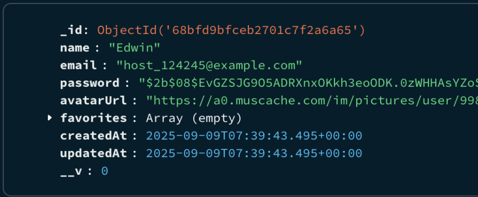
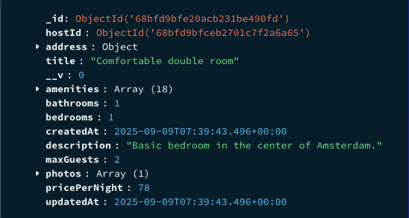
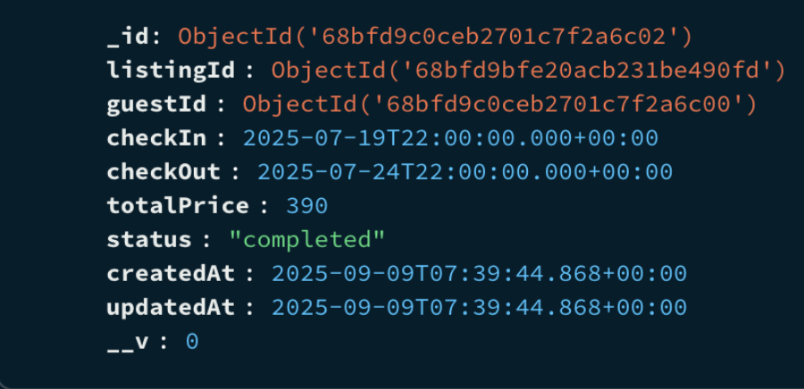
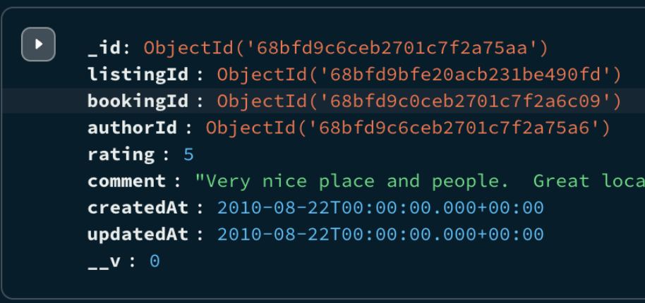

# Staywise Server

Staywise is a backend server for an Airbnb-like platform, built with Node.js, Express, and MongoDB. It provides RESTful APIs for user authentication, property listings, bookings, reviews, and user management.

## Table of Contents

- [Features](#features)
- [Getting Started](#getting-started)
- [Environment Variables](#environment-variables)
- [Project Structure](#project-structure)
- [Data Models](#data-models)
- [API Routes](#api-routes)
- [Utilities](#utilities)

---

## Features

- User authentication (signup, login, JWT-based auth)
- CRUD operations for property listings
- Booking system for guests and hosts
- Review system for listings
- User profile management and favorites
- File uploads (Cloudinary integration)

## Getting Started

1. **Clone the repository**
2. **Install dependencies:**
   ```bash
   npm install
   ```
3. **Set up environment variables:**
   - Copy `.env.example` to `.env` and fill in your values (see below).
4. **Start the server:**
   ```bash
   npm run dev
   ```

## Environment Variables

- `TOKEN_SECRET` - Secret for JWT
- `MONGO_URI` - MongoDB connection string
- `PORT` - Server port (default: 3005)
- `CLOUDINARY_CLOUD_NAME`, `CLOUDINARY_API_KEY`, `CLOUDINARY_API_SECRET` - Cloudinary credentials

## Project Structure

```
config/           # Database connection
error-handling/   # Error handling middleware
middleware/       # Custom Express middlewares
models/           # Mongoose models
routes/           # Express route handlers
uploads/          # File uploads (local)
utils/            # Utility functions (e.g., cascade delete)
validators/       # Request validation logic
server.js         # Entry point
```

## Data Models

### User

- `name`, `email`, `password`, `avatarUrl`, `favorites`, `phone`, `address`

  **Snapshot:**
  

### Listing

- `hostId`, `title`, `description`, `pricePerNight`, `address`, `amenities`, `photos`, `maxGuests`, `bedrooms`, `bathrooms`

  **Snapshot:**
  

### Booking

- `listingId`, `guestId`, `checkIn`, `checkOut`, `totalPrice`, `status`

  **Snapshot:**
  

### Review

- `listingId`, `bookingId`, `authorId`, `rating`, `comment`

  **Snapshot:**
  

### Address (Embedded)

- `line1`, `line2`, `city`, `state`, `country`, `postalCode`, `location`

## API Routes

### Auth (`/api/auth`)

- `POST /signup` - Register a new user
- `POST /login` - Login and receive JWT
- `GET /verify` - Verify JWT and get user info

### Users (`/api/users`)

- `GET /` - Get current user profile
- `PUT /` - Update user profile
- `DELETE /` - Delete user and cascade delete data
- `GET /favorites` - Get user's favorite listings
- `POST /favorites/:listingid` - Add listing to favorites
- `DELETE /favorites/:listingid` - Remove listing from favorites

### Listings (`/api/listings`)

- `GET /` - Get listings (with filters)
- `POST /by-ids` - Get listings by IDs
- `GET /host` - Get listings owned by current host
- `GET /:listingid` - Get listing details
- `GET /:listingid/bookings` - Get bookings for a listing
- `POST /` - Create a new listing (host only)
- `PUT /:listingid` - Update a listing (host only)
- `DELETE /:listingid` - Delete a listing (host only, cascade delete)

### Bookings (`/api/bookings`)

- `GET /` - Get bookings for current user
- `POST /` - Create a new booking
- `PUT /:bookingid/cancel` - Cancel a booking (guest)
- `GET /host` - Get bookings for host's listings
- `PUT /:bookingid/cancel/host` - Cancel a booking (host)

### Reviews (`/api/reviews`)

- `GET /booking/:bookingId` - Get review for a booking
- `POST /` - Create a review
- `PUT /:reviewid` - Update a review
- `DELETE /:reviewid` - Delete a review
- `GET /listings/:listingId` - Get reviews for a listing

## Utilities

- **Cascade Delete:**
  - Deleting a user or listing will also delete related bookings, reviews, and remove from favorites.

---

## License

MIT
